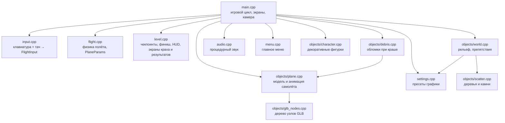
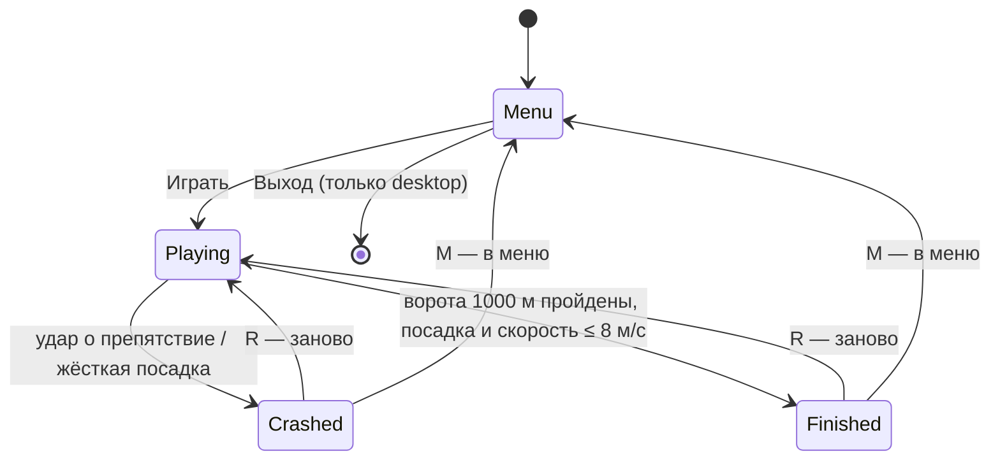

# Архитектура

Игра — один исполняемый файл на C++23 и raylib 5.5. Код устроен как набор
простых структур (`PlaneState`, `LevelState`, `WorldState`…) и свободных
функций над ними, без классов и слоёв абстракции. Один и тот же код
собирается под macOS (desktop) и Web (Emscripten); iOS — в планах.

## Модули

| Модуль | Отвечает за | Ключевые типы и функции |
| --- | --- | --- |
| `src/main.cpp` | Цикл кадра, переключение экранов, камера, порядок отрисовки, загрузка ассетов | `Game`, `Screen`, `UpdateFrame`, `AssetPath` |
| `src/input.cpp` | Ввод с клавиатуры и тача в единую структуру; экранный стик и кнопки | `FlightInput`, `ReadFlightInput`, `DrawTouchOverlay` |
| `src/flight.cpp` | Физика: управляемость зависит от скорости, сопротивление, сваливание, разбег, взлёт, посадка | `PlaneParams`, `BiplaneParams`, `PlaneState`, `UpdatePlaneControls` |
| `src/level.cpp` | Цель уровня (1 км), чекпоинты-кольца, финишные ворота, HUD, экраны краха и результатов | `LevelState`, `UpdateLevel`, `DrawLevelHUD`, `DrawCrashScreen`, `DrawResultsScreen` |
| `src/objects/world.cpp` | Heightmap-рельеф с ровным коридором, цвета вершин рельефа (трава/земля/камень по высоте и уклону плюс запечённая тень от фиксированного света; плоская трава совпадает с фоном), жёсткие и мягкие препятствия, высота земли | `WorldState`, `GetGroundHeight`, `ApplyTerrainColors`, `CheckObstacleHit` |
| `src/objects/scatter.cpp` | Декоративные низкополигональные деревья и камни на холмах вне лётного коридора: детерминированная расстановка (фиксированный seed) по высоте земли, не ближе `flatHalfWidth + 20` м к оси и не ближе 12 м к препятствиям; без коллизий. Список хранится в случайном порядке, плотность выбирает его префикс; рисуется одним потоком треугольников rlgl с отсечением по дальности 450 м | `ScatterState`, `GenerateScatter`, `DrawScatter` |
| `src/objects/plane.cpp` | Загрузка биплана, анимация пропеллера, рулей, элеронов, колёс и поворота головы пилота в вираж (узел `pilot_head_pivot`, до 35°, сглаживание; `pilotHead`: выкл. на Low; в обломки не попадает) | `PlaneModel`, `PlaneAnim`, `UpdatePlaneAnimation`, `DrawPlaneObject` |
| `src/objects/smoke.cpp` | Дым от повреждённого самолёта: кольцевой буфер до 64 клякс (без аллокаций), клякса сзади самолёта поднимается, растёт и тает за 1,5 с; рисуется билбордами одним потоком треугольников rlgl без записи глубины. Число клякс — `smokePuffs` (0 на Low, 24 на Medium, 64 на High); сбрасывается при рестарте/выходе в меню | `SmokeState`, `UpdateSmoke`, `DrawSmoke`, `ClearSmoke` |
| `src/objects/debris.cpp` | Обломки при краше: в момент `level.crashed` от модели отрываются подвижные части (пропеллер, колёса, руль направления, руль высоты, элероны; фиксированный массив до 7 штук, порядок приоритета в `kSpawnOrder`) и летят баллистически: скорость самолёта плюс случайный толчок, гравитация, отскок и трение о рельеф, вращение, остановка при малой скорости. Оторванные части не рисуются на корпусе (маска в `DrawPlaneObject`), сами рисуются через `DrawPlanePart`. Число частей — `debrisPieces` (0 на Low, 3 на Medium, 7 на High); сбрасывается при рестарте/выходе в меню. На физику и геймплей не влияет | `DebrisState`, `SpawnDebris`, `UpdateDebris`, `DrawDebris`, `ClearDebris` |
| `src/objects/glb_nodes.cpp` | Чтение дерева узлов GLB (raylib его теряет) | `GlbNode`, `Mat4`, `LoadGlbNodes` |
| `src/audio.cpp` | Синтез звука в коде: гул двигателя, удар при краше, звон чекпоинта, ветер (зависит от скорости), глухой удар при мягкой посадке, щелчок кнопки UI (не обрывается сбросом `StopOneShotSounds`), глухой стук при мягком ударе о препятствие, общая громкость (`-`/`=`, шаг 0.1) | `EngineAudio`, `UpdateEngineAudio`, `UpdateWindAudio`, `PlayCrashSound`, `PlayChimeSound`, `PlayTouchdownSound`, `PlayClickSound`, `PlayDamageSound`, `SetMasterVolumeClamped` |
| `src/menu.cpp` | Главное меню из списка пунктов; клавиатура, мышь, тач | `MenuState`, `UpdateMenu`, `DrawMenu` |
| `src/settings.cpp` | Пресеты Low/Medium/High и переключатели необязательных эффектов (в т.ч. `terrainColors`: вкл. на Medium/High, на Low рельеф плоско-зелёный; `scatterDensity`: 0 на Low, 0.35 на Medium, 1 на High; `smokePuffs`: 0 / 24 / 64; `debrisPieces`: 0 / 3 / 7) | `GraphicsSettings`, `InitGraphicsSettings` |

## Экраны игры

Пока игра не в экране `Playing`, двигатель молчит; при входе в `Crashed`
один раз звучит удар. После ворот время останавливается, самолёт остаётся управляемым, на HUD баннер
«GATE! Land to finish», за воротами зона посадки; жёсткая посадка или удар
после ворот ведёт в `Crashed` со строкой «Gate reached in X.XX s».
`kRequireLandingAfterGate = false` в `level.cpp` возвращает мгновенный финиш
на воротах. На экране `Finished` физика заморожена, показываются
время, медаль, разница с лучшим временем («+0.84 s» или «NEW BEST»),
чеклист «Finished / All rings / Clean» (невыполненный пункт приглушён
оранжевым), строка со следующей целью и 1–3 звезды (3 = без повреждений и все
чекпоинты, 2 = одно из двух, 1 = просто финиш). Медаль по времени у ворот
(`ComputeMedal`, пороги `kMedalGold/Silver/Bronze` = 24/30/40 с в начале
`level.cpp`). Раскладка экрана масштабируется от высоты окна; лучшее время
хранится только в памяти на время сессии.

## Кадр

1. `ReadFlightInput` собирает ввод (клавиши + тач).
2. В зависимости от экрана: меню, перезапуск или шаг физики
   (`UpdatePlaneControls`) и уровня (`UpdateLevel`), проверка столкновений.
3. Анимация самолёта и звук подстраиваются под состояние.
4. Камера следует сзади-сверху за самолётом.
5. Отрисовка: мир → финиш → чекпоинты → самолёт → фигурки → HUD → оверлеи.

## Самолёт и физика

- Все константы полёта лежат в `PlaneParams` (скорость, разгон,
  сопротивление, сваливание, взлёт, посадка). Новый тип самолёта = новый
  набор параметров, без правки кода физики.
- Знаки: положительный `pitch` — нос вверх, положительный `roll` — крен
  вправо, `yaw` растёт при повороте вправо. Отрисовка (`plane.cpp`)
  инвертирует pitch и roll под правило `rlRotatef` — это задокументировано
  в коде.
- Модель биплана (`assets/models/biplane-1920.glb`) — 74 меша с
  именованными узлами-шарнирами. raylib при загрузке «запекает» узлы в
  вершины, поэтому `glb_nodes.cpp` читает дерево узлов отдельно, и каждая
  подвижная часть рисуется со своей матрицей.

## Ассеты

- Модели лежат в `assets/models/`. CMake после сборки копирует `assets/`
  рядом с исполняемым файлом, а код грузит их по пути от
  `GetApplicationDirectory()`. Поэтому игра запускается из любой рабочей
  папки (терминал, VS Code).
- В Web-сборке ассеты упаковываются в виртуальную ФС Emscripten
  (`--preload-file`), путь — `assets/...`.
- Web-сборка использует свою HTML-оболочку `web/shell.html` (холст на весь экран, без скролла/зума на телефонах, кнопка fullscreen, подсказка про альбомную ориентацию) вместо `minshell.html` из raylib.
- Звуки генерируются в коде, аудиофайлов нет.
- Новые 3D-модели заказываются через `asset-requests/` (промт пишет агент,
  генерирует человек). Процедурный генератор самолётов живёт в ветке
  `design` (`tools/aircraft-gen/`) и в `dev` пока не входит.

## Сборка

| Цель | Как собирается | Зависимости |
| --- | --- | --- |
| macOS desktop | `cmake -S . -B build -DCMAKE_BUILD_TYPE=Release && cmake --build build` | raylib из Conan через cmake-conan provider (ставится автоматически) |
| Web | `emcmake cmake -S . -B build-web -DCMAKE_BUILD_TYPE=Release && cmake --build build-web` | raylib 5.5 через CMake FetchContent; Conan при Emscripten отключён |
| iOS | ещё нет | — |

CI (`.github/workflows/build.yml`) собирает обе цели на каждый push и PR. Web-job дополнительно выкладывает артефакт `FlightGame-web` (`index.html`, `index.js`, `index.wasm`, `index.data` в корне архива) — его можно сразу загружать на itch.io.

## Производительность

Всё, что не влияет на игровой процесс (столбики-маркеры, каркасы
препятствий, фигурки, деревья и камни (`scatterDensity`, 0 на Low), диск пропеллера, поворот головы пилота (`pilotHead`, выкл. на Low), дым повреждённого самолёта (`smokePuffs`, 0 на Low), обломки при краше (`debrisPieces`, 0 на Low), а в будущем погода, частицы), отключается через `GraphicsSettings`. Исключение — `blobShadow`
(полупрозрачная тень самолёта на земле, `DrawBlobShadow` в `world.cpp`,
рисуется после мира и до самолёта без записи в глубину): она почти бесплатна
и помогает оценить высоту, поэтому включена во всех пресетах, включая Low. На Web и мобильных по
умолчанию пресет Low; цель — iPhone 11 и слабые ПК.
