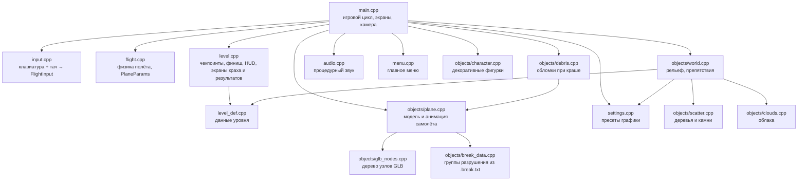
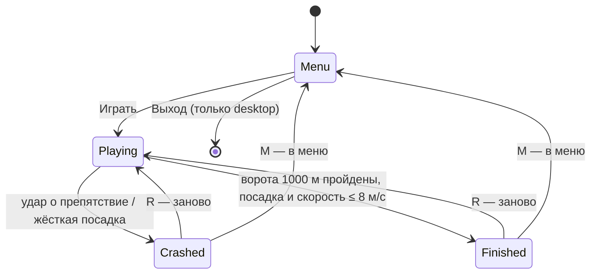

# Архитектура

Игра — один исполняемый файл на C++23 и raylib 5.5. Код устроен как набор
простых структур (`PlaneState`, `LevelState`, `WorldState`…) и свободных
функций над ними, без классов и слоёв абстракции. Один и тот же код
собирается под macOS (desktop) и Web (Emscripten); iOS Simulator — спайк в CI (запуск в симуляторе ещё не проверен).

## Модули

| Модуль | Отвечает за | Ключевые типы и функции |
| --- | --- | --- |
| `src/main.cpp` | Цикл кадра, переключение экранов, камера, порядок отрисовки, загрузка ассетов. При краше считает масштаб взрыва `s = FuelFraction` и запускает взрыв, дым-столб, звук и обломки. Под `#ifdef FLIGHT_DEBUG` (опция CMake `FLIGHT_DEBUG`, по умолчанию выкл., не включать для Web, iOS и релизного CI): переменные `FLIGHT_FUEL` (0..1), `FLIGHT_PRESET` (0..2), `FLIGHT_SPEED`, `FLIGHT_SHOT_PREFIX` и флаг `--crash-test` (пикирование в землю с 60 м, PNG через 0.1 / 0.3 / 1 / 3 с после удара, выход) | `Game`, `Screen`, `UpdateFrame`, `AssetPath`, `FuelTankWorld` |
| `src/input.cpp` | Ввод с клавиатуры и тача в единую структуру; экранный стик и кнопки; после первого касания на экранах игры (не в меню) справа сверху под веб-кнопкой Fullscreen три кнопки «Gfx: <пресет>», «Vol -», «Vol +» (те же действия, что F1 и `-`/`=`; касание по ним не двигает стик) | `FlightInput` (`cycleGraphics`, `volumeStep`), `ReadFlightInput`, `DrawTouchOverlay` |
| `src/touch_layout.cpp` | Геометрия кнопок настроек без raylib (раскладка и попадание точки), проверяется тестом `TouchLayoutTests` | `LayoutSettingsButtons`, `TouchBoxContains` |
| `src/flight.cpp` | Физика: управляемость зависит от скорости, сопротивление, сваливание, разбег, взлёт, посадка | `PlaneParams`, `BiplaneParams`, `PlaneState`, `UpdatePlaneControls`, `FuelFraction` |
| `src/level_def.h`, `src/level_def.cpp` | Данные уровня без raylib (`LevelDef`): стартовая позиция самолёта (x, z и высота над землёй) и форма рельефа (`TerrainDef`: размер сетки, размер мира, макс. высота, полуширина ровного коридора, затухание у края), дистанция ворот, пороги медалей, зона посадки и скорость наката, чекпоинты (смещения от старта и радиус), жёсткие и мягкие препятствия (x, z, высота, радиус); `Level1Def()` возвращает уровень 1. `InitLevel` и `GenerateWorld` читают чекпоинты, препятствия, зону посадки и накат; `GenerateWorld` копирует `TerrainDef` в поля `WorldState`, `main.cpp` ставит самолёт в старт из `LevelDef`; коэффициенты синусов холмов (`ComputeRawHeight`), расстановка деревьев и облаков остаются в коде; дистанция ворот и пороги медалей тоже читаются из `LevelDef` (`LevelState::targetDistance`, `ComputeMedal`, подсказка следующей медали); литералы 1000 м и 24/30/40 с лежат только в `level_def.cpp`. Порядок и числа те же, что раньше были в коде; уровень 2 будет новыми данными | `LevelDef`, `TerrainDef`, `CheckpointDef`, `ObstacleDef`, `Level1Def` |
| `src/level.cpp` | Цель уровня (1 км), чекпоинты-кольца, финишные ворота, HUD, экраны краха и результатов | `LevelState`, `UpdateLevel`, `DrawLevelHUD`, `DrawCrashScreen`, `DrawResultsScreen` |
| `src/objects/world.cpp` | Heightmap-рельеф с ровным коридором, цвета вершин рельефа (трава/земля/камень по высоте и уклону плюс запечённая тень от фиксированного света; плоская трава совпадает с фоном), жёсткие и мягкие препятствия, высота земли | `WorldState`, `GetGroundHeight`, `ApplyTerrainColors`, `CheckObstacleHit` |
| `src/objects/scatter.cpp` | Декоративные низкополигональные деревья и камни на холмах вне лётного коридора: детерминированная расстановка (фиксированный seed) по высоте земли, не ближе `flatHalfWidth + 20` м к оси и не ближе 12 м к препятствиям; без коллизий. Список хранится в случайном порядке, плотность выбирает его префикс; рисуется одним потоком треугольников rlgl с отсечением по дальности 450 м | `ScatterState`, `GenerateScatter`, `DrawScatter` |
| `src/objects/plane.cpp` | Загрузка биплана, анимация пропеллера, рулей, элеронов, колёс и поворота головы пилота в вираж (узел `pilot_head_pivot`, до 35°, сглаживание; `pilotHead`: выкл. на Low; в обломки не попадает; видимое повреждение при `plane.damaged` и `damageVisuals` (выкл. на Low): левый элерон изогнут вниз и почти не слушается руля, он и руль направления затемнены «гарью» через цвет материала меша, без новых ассетов) | `PlaneModel`, `PlaneAnim`, `UpdatePlaneAnimation`, `DrawPlaneObject` |
| `src/objects/clouds.cpp` | Низкополигональные облака над лётным коридором: 30 облаков, детерминированная расстановка (фиксированный seed) вдоль 1 км уровня на высоте 55–120 м, каждое из 3–5 приплюснутых эллипсоидов с плоским затенением; без коллизий и влияния на физику. Список в случайном порядке, `cloudCount` выбирает префикс (F1 не требует регенерации); рисуется потоком треугольников rlgl, облака дальше 600 м отсекаются | `CloudsState`, `GenerateClouds`, `DrawClouds` |
| `src/objects/smoke.cpp` | Дым от повреждённого самолёта: кольцевой буфер до 64 клякс (без аллокаций), клякса сзади самолёта поднимается, растёт и тает за 1,5 с; рисуется билбордами одним потоком треугольников rlgl без записи глубины. Число клякс — `smokePuffs` (0 на Low, 24 на Medium, 64 на High); сбрасывается при рестарте/выходе в меню. Режим `ExplosionSmoke` (отдельный `SmokeState` `crashSmoke` в `Game`, поле независимо от дыма повреждения): столб из точки `fuel_tank`, клякса живёт 2.5 с, тёмнее и крупнее, растёт и поднимается быстрее с `s`; столб длится `2 + 6 s` с, число одновременных клякс `max(4, explosionSmoke * (0.3 + 0.7 s))`; при `s < 0.05` лишь короткий пыльный всплеск (около 4 клякс) | `SmokeState`, `UpdateSmoke`, `DrawSmoke`, `ClearSmoke`, `StartExplosionSmoke`, `UpdateExplosionSmoke` |
| `src/objects/streaks.cpp` | Полосы скорости: фиксированный пул до 40 тонких линий вокруг камеры (без аллокаций), вытянуты вдоль направления полёта, прозрачный хвост; появляются при скорости выше 60% от максимальной и плавно усиливаются, пропадают на земле/после краша/вне игры; пролетевшие мимо полосы пересоздаются впереди; рисуются одним потоком линий rlgl без записи глубины. Число полос — `speedStreaks` (0 на Low, 16 на Medium, 40 на High); сбрасывается при рестарте/выходе в меню. Только визуал, физику не трогает | `StreakState`, `UpdateStreaks`, `DrawStreaks`, `ClearStreaks` |
| `src/objects/rain.cpp` | Дождь: фиксированный пул до 200 тонких капель-линий в коробке 90×60×90 м вокруг камеры (без аллокаций), капли падают с лёгким ветром и заворачиваются по краям коробки при движении самолёта; начальная расстановка детерминирована (фиксированный seed), на каждый кадр только арифметика. Дождь и снег взаимоисключающие (см. `snow.cpp`): дождь идёт, если `rainDrops` > 0 и в текущем прогоне не выбран снег (системы погоды нет). Рисуется из `DrawWorldObject` одним потоком линий rlgl с прозрачным хвостом без записи глубины; сбрасывается при рестарте/выходе в меню. Число капель — `rainDrops` (0 на Low, 80 на Medium, 200 на High). Только визуал, физику не трогает | `RainState`, `UpdateRain`, `DrawRain`, `ClearRain` |
| `src/objects/snow.cpp` | Снег: фиксированный пул до 200 хлопьев (повёрнутые к камере квадраты ~0,5 м из двух треугольников, один поток rlgl, без записи глубины, с проверкой глубины) в коробке 60×45×60 м вокруг камеры, медленное падение ~2–3 м/с с плавным боковым дрейфом (синус по фазе хлопьев), заворачивание по краям коробки; seed фиксирован. Дождь и снег взаимоисключающие: `WorldState::snowRun` переключается (`AdvanceWeather`) только при старте прогона (Play из меню, рестарт R), но не при выходе в меню, поэтому меню показывает погоду последнего прогона; если обе величины > 0, прогоны чередуются (первый — снег); если одна из них 0 (Low, Medium), работает только другая. `ActiveRainDrops`/`ActiveSnowFlakes` дают итоговые числа для обновления и отрисовки. Рисуется из `DrawWorldObject` (виден и за меню); число хлопьев — `snowFlakes` (0 на Low и Medium, 200 на High). Только визуал, физику не трогает | `SnowState`, `UpdateSnow`, `DrawSnow`, `ClearSnow` |
| `src/objects/debris.cpp` | Обломки при краше: в момент `level.crashed` от модели отрываются группы разрушения из `.break.txt` (крыло вместе со стойками и растяжками, шасси, оперение, пропеллер, кабана, двигатель; корпус с пилотом остаётся), какие группы отрываются, решает удар: `main.cpp` передаёт `ImpactInfo` (точка, скорость, модуль скорости, признак удара о землю; скорость включает `fallSpeed`), `SpawnDebris` считает энергию `E = 0.5 * speed^2` и для каждой группы экспозицию по направлению от центра корпуса (центр габаритов группы `hull`) к суставу относительно направления удара (0.35 + 0.65 * cos, в пределах 0.2..1.0; при ударе о землю +0.3 самым нижним суставам). Сустав рвётся, если `E * экспозиция >= прочность * jointScale` (разброс прочности ±15% по детерминированному зерну от точки и скорости удара, поэтому один и тот же удар даёт один и тот же результат). Дети оторванной группы летят вместе с ней. Число оторванных корней ограничено `debrisPieces` (4 на Low, 6 на Medium, 12 на High; минимум 1): остаются самые перегруженные, но сначала берутся по одной группе из каждой записи `keep` (пропеллер, крыло, шасси), если они вообще оторвались. Если ни один сустав не порвался, отрывается самая перегруженная группа. Строка `BREAK: impact ...` в логе показывает перегрузку каждой группы. Если файла нет или он не прошёл проверку, летят прежние 7 подвижных частей (пропеллер, колёса, руль направления, руль высоты, элероны; порядок в `kSpawnOrder`). Физика полёта обломков (шаг не больше 1/60 с): скорость = 0.8 скорости удара плюс импульс `0.2 * избыток энергии / масса группы` в сторону от центра корпуса через сустав (с подъёмом вверх, потолок 30 м/с), вращение от плеча сустава (`cross(r, J) / (m * R^2 * 0.4)` плюс зерно, до 540°/с), гравитация, сопротивление 0.1/с, ориентация — кватернион. Контакт с рельефом считается по реальным вершинам группы: 26 крайних по направлениям куба, прореженная по вокселям выборка остальных (до 128) и лопасти пропеллера; самая глубокая вершина получает импульс контакта (отскок 0.35 только при быстром ударе, трение), поэтому крыло ложится плашмя, а не парит и не тонет. Остановка: при малых скорости и вращении (или через 4.5 с) группа за 0.3 с плавно доворачивается гранью вниз (грань с наименьшей высотой центра масс среди повёрнутых вниз), встаёт на 0.05 м над рельефом, один раз раздвигается с уже лежащими соседями по габаритам и больше не пересчитывается. Обломки с корпусом, деревьями и препятствиями не сталкиваются; запасные 7 частей без файла используют ту же физику. Оторванное не рисуется на корпусе (маски частей и групп в `DrawPlaneObject`), само рисуется через `DrawPlaneGroup` / `DrawPlanePart`. Сбрасывается при рестарте/выходе в меню. На физику и геймплей не влияет | `DebrisState`, `SpawnDebris`, `UpdateDebris`, `DrawDebris`, `ClearDebris` |
| `src/objects/explosion.cpp` | Огненная часть краша из `fuel_tank`, масштаб `s = clamp(fuel / fuelCapacity, 0, 1)`. При `s < 0.05` ничего. High: 3 шара огня (радиус до 6 м * `s`, растут 0.4 с, гаснут 1.2 с, оранжевый -> тёмный) и белая вспышка `0.35 * s` на 0.15 с поверх экрана; Medium: один шар, без вспышки; Low: без геометрии огня, оранжевое кольцо-билборд на 0.3 с. Шары рисуются как полупрозрачные сферы без записи глубины. Сбрасывается при рестарте/выходе в меню. Обломки при этом получают множитель импульса `1 + 0.5 s` (`ImpactInfo::impulseBoost`). На физику полёта не влияет | `ExplosionState`, `StartExplosion`, `UpdateExplosion`, `DrawExplosion`, `DrawExplosionFlash`, `ClearExplosion` |
| `src/objects/break_data.cpp` | Читает `assets/models/biplane-1920.break.txt` (путь = путь GLB с `.glb` заменённым на `.break.txt`; формат в `design-notes/breakup-v2.md`): группы (масса, прочность, узлы), суставы, порядок отрыва, записи `keep` (какие группы читаемости остаются при лимите), бак. Проверяет: неизвестный узел, узел в двух группах, цикл суставов, группа без сустава, масса/прочность <= 0 (у `hull` прочность `-`), нет `hull`, больше 16 групп; при ошибке пишет предупреждение и данные считаются недействительными (откат на 7 частей). Привязывает каждый меш к группе по предкам узла (побеждает ближайший явно перечисленный предок, остальное — в `hull`), считает центр и габариты групп, пишет в лог число мешей каждой группы (пустая группа — предупреждение). Прочности используются в `SpawnDebris` | `BreakData`, `BreakGroup`, `LoadBreakData` |
| `src/objects/glb_nodes.cpp` | Чтение дерева узлов GLB (raylib его теряет) | `GlbNode`, `Mat4`, `LoadGlbNodes` |
| `src/audio.cpp` | Синтез звука в коде: гул двигателя, удар при краше (плюс низкий гул взрыва `boomSound`, который синтезируется при каждом краше: громкость `0.25 + 0.75 s`, длина `0.8 + 1.8 s` с, при `s < 0.05` его нет; в лог пишется строка `AUDIO: crash s=... boom gain=...`), звон чекпоинта, ветер (зависит от скорости), глухой удар при мягкой посадке, щелчок кнопки UI (не обрывается сбросом `StopOneShotSounds`), глухой стук при мягком ударе о препятствие, общая громкость (`-`/`=`, шаг 0.1) | `EngineAudio`, `UpdateEngineAudio`, `UpdateWindAudio`, `PlayCrashSound(audio, s)`, `PlayChimeSound`, `PlayTouchdownSound`, `PlayClickSound`, `PlayDamageSound`, `SetMasterVolumeClamped` |
| `src/safe_area.cpp` | Отступы безопасной зоны (вырез/индикатор «Домой») в экранных единицах. Только iOS: разница `SDL_GetDisplayBounds` и `SDL_GetDisplayUsableBounds` для дисплея 0, пересчитанная в размер окна; на desktop и Web всегда нули. `GetSafeRect` — экран минус отступы. Применяется к HUD (`main.cpp`, `DrawLevelHUD`), тач-кнопкам и стику (`input.cpp`), меню (пункты, заголовок, подсказка; отрисовка и хит-тест через `EntryRect`), экранам краха и результатов (центрируются по безопасной зоне, затемнение на весь экран); на iOS не проверено | `SafeArea`, `GetSafeArea`, `GetSafeRect` |
| `src/menu.cpp` | Главное меню из списка пунктов; клавиатура, мышь, тач | `MenuState`, `UpdateMenu`, `DrawMenu` |
| `src/settings.cpp` | Пресеты Low/Medium/High и переключатели необязательных эффектов (в т.ч. `terrainColors`: вкл. на Medium/High, на Low рельеф плоско-зелёный; `scatterDensity`: 0 на Low, 0.35 на Medium, 1 на High; `cloudCount`: 0 / 12 / 30; `smokePuffs`: 0 / 24 / 64; `debrisPieces`: 4 / 6 / 12; `explosionFire` (шары огня; на Low вместо них оранжевое кольцо): выкл. / вкл. / вкл.; `explosionSmoke` (клякс в дым-столбе от краша): 12 / 32 / 64; `speedStreaks`: 0 / 16 / 40; `rainDrops`: 0 / 80 / 200; `snowFlakes`: 0 / 0 / 200) | `GraphicsSettings`, `InitGraphicsSettings` |
| `src/progress.cpp`, `src/progress_store.cpp` | Сохранение прогресса (только данные, в игру пока не подключено): лучшее время и звёзды по уровням, флаги разблокировок, громкость, пресет. Текстовый формат `key=value` с `version=1`; неизвестные ключи и битые строки пропускаются. Хранилище: desktop — `progress.cfg` рядом с исполняемым файлом, Web — `localStorage` (ключ `flightgame.progress`), iOS — заглушка | `ProgressData`, `RecordLevelResult`, `ParseProgress`, `SerializeProgress`, `LoadProgress`, `SaveProgress` |

## Экраны игры

Пока игра не в экране `Playing`, двигатель молчит; при входе в `Crashed`
один раз звучит удар. После ворот время останавливается, самолёт остаётся управляемым, на HUD баннер
«GATE! Land to finish», за воротами зона посадки; жёсткая посадка или удар
после ворот ведёт в `Crashed` со строкой «Gate reached in X.XX s».
`requireLanding = false` в `Level1Def()` (`level_def.cpp`) возвращает мгновенный финиш
на воротах. На экране `Finished` физика заморожена, показываются
время, медаль, разница с лучшим временем («+0.84 s» или «NEW BEST»),
чеклист «Finished / All rings / Clean» (невыполненный пункт приглушён
оранжевым), строка со следующей целью и 1–3 звезды (3 = без повреждений и все
чекпоинты, 2 = одно из двух, 1 = просто финиш). Медаль по времени у ворот
(`ComputeMedal`, пороги `medalGold/Silver/Bronze` = 24/30/40 с в
`LevelDef`, `src/level_def.cpp`). Раскладка экрана масштабируется от высоты окна; лучшее время
хранится только в памяти на время сессии.

## Кадр

1. `ReadFlightInput` собирает ввод (клавиши + тач).
2. В зависимости от экрана: меню, перезапуск или шаг физики
   (`UpdatePlaneControls`) и уровня (`UpdateLevel`), проверка столкновений.
3. Анимация самолёта и звук подстраиваются под состояние.
4. Камера следует сзади-сверху за самолётом.
5. Отрисовка: мир → финиш → чекпоинты → самолёт → фигурки → HUD → оверлеи.

## Самолёт и физика

- Все константы полёта лежат в `PlaneParams` (скорость, разгон,
  сопротивление, сваливание, взлёт, посадка). Новый тип самолёта = новый
  набор параметров, без правки кода физики.
- Газ — постоянный уровень мощности двигателя `enginePower` (0..1): W/S
  (и кнопки +/- на таче) только меняют его со скоростью `throttleRate`, он
  остаётся где оставлен. Тяга = `enginePower × accel`, в воздухе газ никогда
  не тормозит. Есть гравитация: скорость теряется/набирается по углу
  тангажа (`gravity`), при мощности ниже `levelPower` авто-триммер уводит
  нос в планирование (`glideRatio`), а ниже скорости сваливания подъёмная
  сила пропадает и самолёт падает (`fallSpeed`). Обороты пропеллера и звук
  двигателя следуют за `enginePower`, при нулевой мощности пропеллер
  медленно вращается от потока. На земле при нулевой мощности S включает
  тормоз колёс.
- Повороты: в воздухе скорость разворота — по координированному вираже,
  `g·tan(крен)/v` (v не ниже `stallSpeed`, предел `maxTurnRate`), поэтому
  на малой скорости радиус большой, на большой крутой поворот возможен
  только крутым креном. Руль направления даёт лишь небольшой дополнительный
  рыск (`yawRate`, 8°/с). Подъёмная сила умножается на `cos(крен)`, так что
  в вираже самолёт проседает, пока нос не поднят. На земле скорость
  разворота = `скорость / taxiTurnRadius` (не выше `taxiMaxTurnRate`):
  на месте не вертится.
- Знаки: положительный `pitch` — нос вверх, положительный `roll` — крен
  вправо, `yaw` растёт при повороте вправо. Отрисовка (`plane.cpp`)
  инвертирует pitch и roll под правило `rlRotatef` — это задокументировано
  в коде.
- Модель биплана (`assets/models/biplane-1920.glb`) — 74 меша с
  именованными узлами-шарнирами. raylib при загрузке «запекает» узлы в
  вершины, поэтому `glb_nodes.cpp` читает дерево узлов отдельно, и каждая
  подвижная часть рисуется со своей матрицей.

## Ассеты

- Модели лежат в `assets/models/`. CMake после сборки копирует `assets/`
  рядом с исполняемым файлом, а код грузит их по пути от
  `GetApplicationDirectory()`. Поэтому игра запускается из любой рабочей
  папки (терминал, VS Code).
- В Web-сборке ассеты упаковываются в виртуальную ФС Emscripten
  (`--preload-file`), путь — `assets/...`.
- Web-сборка использует свою HTML-оболочку `web/shell.html` (холст на весь экран, без скролла/зума на телефонах, кнопка fullscreen, подсказка про альбомную ориентацию, индикатор загрузки «Loading…» с тонкой полосой прогресса по `Module.setStatus` — скрывается, когда Emscripten сообщает о запуске; при исключении или abort остаётся с текстом ошибки) вместо `minshell.html` из raylib.
- Звуки генерируются в коде, аудиофайлов нет.
- Новые 3D-модели заказываются через `asset-requests/` (промт пишет агент,
  генерирует человек). Процедурный генератор самолётов живёт в ветке
  `design` (`tools/aircraft-gen/`) и в `dev` пока не входит.

## Сборка

| Цель | Как собирается | Зависимости |
| --- | --- | --- |
| macOS desktop | `cmake -S . -B build -DCMAKE_BUILD_TYPE=Release && cmake --build build` | raylib из Conan через cmake-conan provider (ставится автоматически) |
| Web | `emcmake cmake -S . -B build-web -DCMAKE_BUILD_TYPE=Release && cmake --build build-web` | raylib 5.5 через CMake FetchContent; Conan при Emscripten отключён |
| Тесты физики (desktop) | `ctest --test-dir build --output-on-failure` после обычной сборки; цель `FlightTests` (`tests/flight_tests.cpp` + `src/flight.cpp`), без окна и GL, не входит в Web и iOS | Только заголовки raylib; пороги взяты из замеров текущего кода (взлёт, глиссада, радиус виража включая зажим maxTurnRate при крене 75° на 20 м/с, сваливание и порог stallSpeed, разгон и скорость горизонтального полёта, посадка по темпу снижения / наклону носа вниз и вверх / крену отдельно, зажим maxRoll при удержании крена, время до ворот при прямом пролёте на полном газу (взлёт, затем 1000 м; допуск от 17 с до порога золота, замер 20,48 с), неподвижность на земле с контрольными случаями) |
| Тесты определения уровня (desktop) | цель `LevelDefTests` (`tests/level_def_tests.cpp` + `src/level_def.cpp`), входит в `ctest`, без raylib | Все числа уровня 1 (старт, форма рельефа, количество и значения чекпоинтов, препятствий, зоны посадки, медалей); чекпоинты по возрастанию z и внутри дистанции ворот; препятствия внутри дистанции; золото < серебро < бронза |
| Тесты разрушения (desktop) | цель `BreakupTests` (`tests/breakup_tests.cpp` + `src/objects/debris.cpp`, `plane.cpp`, `break_data.cpp`, `glb_nodes.cpp`, `flight.cpp`), входит в `ctest`, без окна и GL; нужен только линк с raylib | `PlaneModel` собирается вручную из боксов (сгруппированный с `BreakData` и запасной с фиксированными частями), `GetGroundHeight` подменён в тесте (плоско, склон, ступени). Шесть ударов (скорость 12–70 м/с, разный тангаж, крен, курс, земля и препятствие) → `SpawnDebris` → `UpdateDebris` до остановки (не дольше 12 с); проверяется, что обломки появились, все остановились и `DebrisLowestClearance` каждого не ниже −0,01 м (замер 0,05 м) |
| Тесты прогресса (desktop) | цель `ProgressTests` (`tests/progress_tests.cpp` + `src/progress.cpp`), входит в `ctest`, без raylib | Круговой обход сериализации, лучшее время и звёзды, зажим значений, неизвестная версия, битые строки |
| iOS Simulator (спайк) | CI-job `ios-sim`: `cmake -G Xcode -DCMAKE_SYSTEM_NAME=iOS -DCMAKE_OSX_SYSROOT=iphonesimulator`, без подписи; ветка `iOS` в `CMakeLists.txt` | raylib 5.5 (бэкенд SDL, OpenGL ES 2.0) и SDL2 через FetchContent; Conan отключён |

CI (`.github/workflows/build.yml`) собирает desktop (и гоняет `ctest`) и Web (job `ios-sim` — `continue-on-error`, пока это спайк: падение не краснит `dev`; точка входа SDL на iOS сделана через `SDL_main.h` + `SDL2main`, но запуск не проверен; тач-цикл на iOS не проверен) на каждый push и PR. Бандл iOS использует `ios/Info.plist.in` (через `MACOSX_BUNDLE_INFO_PLIST`): только landscape (`UISupportedInterfaceOrientations` и `~ipad`), `UIRequiresFullScreen`, скрытый статус-бар и пустой `UILaunchScreen` (системный фон без ассетов); job `ios-sim` проверяет эти ключи через PlistBuddy (в симуляторе не проверено). Иконка приложения: `ios/Assets.xcassets/AppIcon.appiconset` (один PNG 1024×1024 без альфы, формат Xcode 14+), подключена только в iOS-ветке CMake (`ASSETCATALOG_COMPILER_APPICON_NAME=AppIcon`); PNG воспроизводится скриптом `tools/make_icon.py` (чистый Python); job проверяет `Assets.car` и `CFBundleIcons` в собранном .app (на CI не проверено). Web-job дополнительно выкладывает артефакт `FlightGame-web` (`index.html`, `index.js`, `index.wasm`, `index.data` в корне архива) — его можно сразу загружать на itch.io.

## Производительность

Всё, что не влияет на игровой процесс (столбики-маркеры, каркасы
препятствий, фигурки, деревья и камни (`scatterDensity`, 0 на Low), облака (`cloudCount`, 0 на Low), диск пропеллера, поворот головы пилота (`pilotHead`, выкл. на Low), видимое повреждение самолёта (`damageVisuals`, выкл. на Low; флаг `damaged` и HUD работают всегда), дым повреждённого самолёта (`smokePuffs`, 0 на Low), обломки при краше (`debrisPieces`, 4 на Low: предел числа оторванных групп, не выключатель), полосы скорости (`speedStreaks`, 0 на Low), дождь (`rainDrops`, 0 на Low), снег (`snowFlakes`, 0 на Low и Medium; не одновременно с дождём), а в будущем частицы), отключается через `GraphicsSettings`. Исключение — `blobShadow`
(полупрозрачная тень самолёта на земле, `DrawBlobShadow` в `world.cpp`,
рисуется после мира и до самолёта без записи в глубину): она почти бесплатна
и помогает оценить высоту, поэтому включена во всех пресетах, включая Low. На Web и мобильных по
умолчанию пресет Low; цель — iPhone 11 и слабые ПК.
