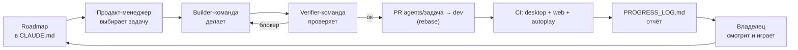
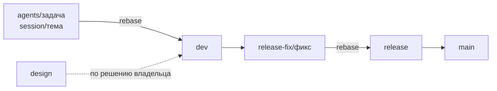

# Процесс работы

Владелец решает, что делать и что выпускать. Агенты делают и проверяют
работу сами, по расписанию, и отчитываются в репозитории. Всё, что нужно
агенту, лежит в репозитории: облачный запуск начинает с нуля и видит только
то, что запушено на GitHub.

## Кто что делает

| Роль | Кто | Что делает |
| --- | --- | --- |
| Владелец | человек | Ставит цели, играет и даёт отзывы, генерирует 3D-модели по заявкам, режет релиз и выпускает в `main` |
| Интерактивная сессия | Claude Code на машине владельца | Настраивает процесс, правит roadmap, разбирает сложные задачи вместе с владельцем, проверяет то, что нельзя проверить в облаке (звук, браузер, экран) |
| Продакт-менеджер | облачный запуск по расписанию | Выбирает следующую задачу, раздаёт её агентам, мёржит, пишет отчёт |
| Builder-команда | game-designer, game-developer, asset-planner | Придумывает контент, пишет код, заказывает и подключает модели |
| Verifier-команда | game-tester, code-reviewer | Собирает, запускает, читает diff и ищет проблемы; может заблокировать мердж |
| Выкатка | release-manager | Строит план выкатки (куда, когда, как), переносит фиксы в `release`, собирает пакеты, пишет release notes; до публикации ждёт «да» владельца |

## Путь одной задачи

1. **Задача.** Берётся следующий пункт roadmap из `CLAUDE.md` (сейчас —
   спринт «Web v0.1»). Сверяется с `design-notes/release-plan.md` и
   `PLAYER_FEEDBACK.md`.
2. **Защита от наложения.** Если предыдущий запуск ещё не вмёржил свою
   работу, новый сразу завершается.
3. **Сделать.** game-developer пишет код, собирает и коротко запускает игру.
4. **Проверить.** game-tester и/или code-reviewer проверяют по-настоящему,
   а не на слово. На блокер — один круг исправлений; не исправилось —
   задача не мёржится, а описывается в отчёте.
5. **Слить.** PR `agents → dev`, проверка CI, мердж. В коммитах и PR нет
   упоминаний ИИ.
6. **Отчитаться.** Запись в `PROGRESS_LOG.md`: что сделано, почему, как
   проверено, что осталось открытым. Вехи — в `docs/DEVELOPMENT_HISTORY.md`.

## Расписание

Время московское.

| Когда | Запуски | Объём |
| --- | --- | --- |
| 12:00, 18:00 | 2 | одна задача |
| каждый час 19:00–08:00 | до 14 | одна, максимум две небольшие задачи |

Ночью запусков больше, чтобы агенты тратили лимит, пока владелец не
работает. Интерактивная сессия может запускать прогоны вне расписания.

## Ветки и выпуск

Правило владельца: **в `dev` и `release` ничего не коммитится напрямую.**
Каждая задача — своя промежуточная ветка, интеграция через rebase (без
merge-коммитов), ветки после интеграции не удаляются — по ним видна
история каждой задачи.

| Ветка | Что в ней | Кто пишет |
| --- | --- | --- |
| `agents/<дата-время>-<задача>` | одна задача агента, остаётся для истории | агенты |
| `session/<тема>` | одна тема интерактивной сессии | интерактивная сессия |
| `dev` | всё, что прошло проверку и CI | только через rebase из веток выше |
| `design` | генератор самолётов и новые модели | интерактивная сессия, агент aircraft-generator |
| `release-fix/<фикс>` | перенос одного фикса в релиз | release-manager |
| `release` | кандидат на выпуск, только фиксы | только через rebase из `release-fix/*` |
| `main` | то, что выпущено, с тегом версии | только по «да» владельца |

Выпуск ведёт release-manager по плану `design-notes/rollout-plan.md`:
фиксы из `dev` переносятся в `release` → сборка на скрытую страницу
itch.io → тест → по «да» владельца страница публикуется, `release`
уходит в `main` с тегом `v0.x`. Пакеты лежат в `dist/` внутри проекта.

## 3D-модели

API для генерации моделей нет. asset-planner пишет промт и путь файла в
`asset-requests/pending/`, владелец генерирует модель и кладёт её по этому
пути, следующий запуск подключает её к игре. Самолёты дополнительно умеет
делать процедурный генератор в ветке `design`.

## Документация

| Файл | Что в нём | Когда обновляется |
| --- | --- | --- |
| `CLAUDE.md` | правила, roadmap, текущее состояние — для агентов | при смене плана или правил |
| `PROGRESS_LOG.md` | журнал каждого прогона | каждый прогон |
| `docs/DEVELOPMENT_HISTORY.md` | вехи и решения | когда закрыт пункт roadmap |
| `docs/ARCHITECTURE.md` | модули, экраны, сборка, ассеты | когда меняется структура кода |
| `docs/STATUS.md` | состояние игры, стопперы, планы — одна страница для владельца | агент-отчётчик, 3 раза в сутки |
| `docs/PROCESS.md` | этот файл | когда меняется процесс |
| `design-notes/` | дизайн-предложения и план релиза | по мере работы |

## Правила, которые нельзя нарушать

- Никаких упоминаний Claude или ИИ в коммитах и PR.
- Агенты никогда не трогают `main`; в `release` пишет только release-manager
  (cherry-pick фиксов). Публикация, `main`, теги и магазины — только по «да»
  владельца.
- Все файлы, включая сборки и пакеты, — только внутри папки проекта.
- Без force-push и переписывания истории без прямой просьбы владельца.
- Изменение считается проверенным только после реальной сборки и запуска,
  а не по чтению diff.
- Всё необязательное визуальное — отключаемо (слабые ПК, iPhone 11).
